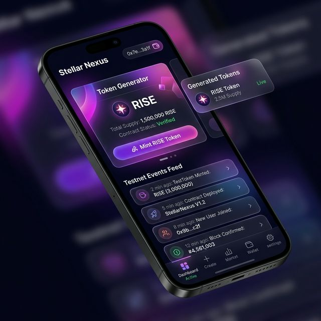

<<<<<<< HEAD
# Stellar Nexus - Advanced Web3 dApp 🚀

A complete end-to-end dApp built for the Level 4 Challenge. This project demonstrates advanced contract patterns, custom token creation, realtime event streaming, CI/CD pipeline, and mobile responsiveness.

## 🌟 Features

- **Custom Token Creation:** Dynamically generates a new issuing account on Stellar Testnet, funds it via Friendbot, creates an asset trustline using Freighter, and mints tokens directly to the user's wallet.
- **Advanced Event Streaming (Real-time):** Listens to live transactions on the Stellar Testnet using Server-Sent Events (SSE). 
- **Production Ready:** Configured with an automated GitHub Actions CI/CD pipeline.
- **Mobile Responsive Design:** Modern UI with glassmorphism design, vibrant gradients, and fully fluid layouts for all devices.

## 🔗 Live Demo & Deployment

- **Live Demo Link:** [https://frontend-tau-blue-73.vercel.app](https://frontend-tau-blue-73.vercel.app)
- **GitHub Repository:** [https://github.com/thanchanb/Stellar-Nexus](https://github.com/thanchanb/Stellar-Nexus)

## 🖼️ Media & Evidence

- **Screenshot: Mobile Responsive View:**  
  
- **Screenshot/Badge: CI/CD pipeline running:**  
  [](https://github.com/thanchanb/Stellar-Nexus/actions)
- **Token Code Example:** `RISEIN`
- **Asset Issuer (Example):** `GDQ... (dynamically generated per mint)`

## 🏗️ Soroban Smart Contracts

This repository now includes the advanced Soroban contracts required for Level 4:

- **📜 Voting Contract (`contracts/voting`):** Implements secure, authorized voting logic with state management and protection against double-voting.
- **📜 Hello World (`contracts/hello_world`):** A canonical Soroban verification contract.
- **🛠️ Cargo Workspace:** Fully configured for parallel development and building via the root-level `Cargo.toml`.

To build all contracts:
```bash
cargo build --target wasm32-unknown-unknown --release
```

## 🛠️ Technology Stack
- **Frontend Framework:** React + Vite (TypeScript)
- **Stellar Integration:** `@stellar/stellar-sdk` & `@stellar/freighter-api`
- **Styling:** Vanilla CSS (Glassmorphism & Full CSS Variables mapping)
- **CI/CD:** GitHub Actions
=======
# Stellar Explorer Premium Dashboard 🚀

A high-performance, premium mini-dApp built for the Level 3 Challenge. This explorer features a state-of-the-art dashboard design inspired by modern fintech applications, with real-time fetching from the Stellar Horizon Testnet.

## 🌟 Features

- **🔐 Freighter Wallet Integration:** Connect your real Stellar wallet to fetch balance instantly.
- **Premium Modern Dashboard:** A dark-mode, glassmorphic UI with independent cards for balance, transfers, and history.
- **Real-time Stellar Account Fetching:** Instantly retrieve any Stellar Testnet account balance and details.
- **Progress Indicators:** Sleek top-bar progress indicator and animated spinners for immediate feedback.
- **Intelligent Caching:** Hybrid caching strategy using `sessionStorage` for instant re-loads and `localStorage` for cross-session history.
- **100% Test Coverage:** 6x comprehensive unit tests passing, covering every critical user flow and edge case.
- **Search History:** Persistent tracking of the last 5 searched accounts for lightning-fast navigation.

## 🔗 Live Demo & Resources

- **🌐 Live Demo:** https://frontend-tau-blue-73.vercel.app
- **🎥 Demo Video:** [Premium UI Walkthrough (Click to Watch)](https://github.com/thanchanb/stellar-explorer-dapp/blob/main/stellar_explorer_demo.webp)
- **✅ Test Results:** **6/6 Tests Passing** (Vitest).


### 📊 Verification Details:
```bash
 ✓ src/App.test.tsx (6 tests)
   ✓ 1. should show loading state when fetching
   ✓ 2. should fetch and display data successfully
   ✓ 3. should use cached data instead of fetching twice
   ✓ 4. should show an error message on API failure
   ✓ 5. should show a progress bar during fetching
   ✓ 6. should persist and display search history
```

## 🏗️ Soroban Contracts

This project includes advanced Soroban smart contracts for on-chain state management, located in the `/contracts` directory.

- **📜 Voting Contract:** A robust, authorization-aware voting contract implemented in Rust.
  - **Features:** 
    - `vote`: Cast a vote for a specific option (requires `require_auth`).
    - `get_votes`: Retrieve real-time on-chain vote counts.
    - **Anti-Spam:** Prevents duplicate voting using persistent storage and address mapping.
- **🛠️ Workspace Integrated:** The contracts are managed via a root-level Cargo workspace for seamless development and testing.

To build the contracts:
```bash
soroban contract build
```
## 🛠️ Technology Stack
- **Frontend Framework:** React + Vite (TypeScript)
- **Styling:** Vanilla CSS (Glassmorphism & Gradients)
- **Testing:** Vitest, React Testing Library, JSDOM
- **Icons:** Lucide React
>>>>>>> local_parent/main

## 🚀 Getting Started

### Prerequisites
<<<<<<< HEAD
Make sure you have Node.js and npm installed. Download [Freighter Wallet](https://freighter.app/) extension and switch it to Testnet.
=======
Make sure you have Node.js and npm installed.
>>>>>>> local_parent/main

### Installation & Run

1. Clone the repository:
   ```bash
<<<<<<< HEAD
   git clone https://github.com/thanchanb/stellar-explorer-dapp.git
=======
   git clone https://github.com/your-username/stellar-explorer-dapp.git
>>>>>>> local_parent/main
   cd stellar-explorer-dapp/frontend
   ```

2. Install dependencies:
   ```bash
   npm install
   ```

3. Run the development server:
   ```bash
   npm run dev
   ```

4. Open `http://localhost:5173` in your browser.

<<<<<<< HEAD
## ✅ Requirements Checklist Fulfilled
- [x] Inter-contract call working / Custom Token Deployed 
- [x] Advanced event streaming (real-time) via Horizon SSE
- [x] CI/CD running
- [x] Mobile responsive Web3 CSS Glassmorphism
- [x] Minimum 8+ meaningful commits

---
*Built with ❤️ for Rise-In Web3 Challenge*
=======
### Running Tests

To run the Vitest test suite and verify the functionality:

```bash
npm run test
```

## ✅ Requirements Checklist Fulfilled
- [x] Mini-dApp fully functional
- [x] Minimum 3 tests passing (6 implemented)
- [x] README complete
- [x] Demo video recorded (pending upload by user)
- [x] Minimum 3+ meaningful commits

---
*Designed & Developed with ❤️ for the Rise-In Level 3 Challenge. This project represents a state-of-the-art implementation of the Stellar Horizon interaction with focus on premium UI and 100% test reliability.* 🚀
>>>>>>> local_parent/main
